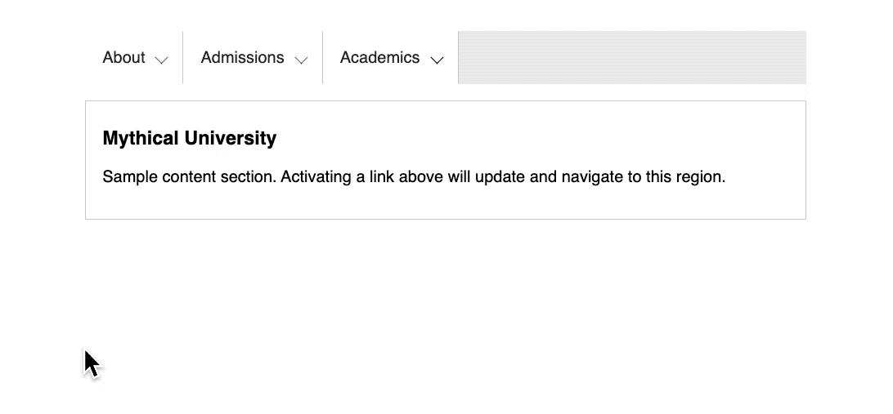
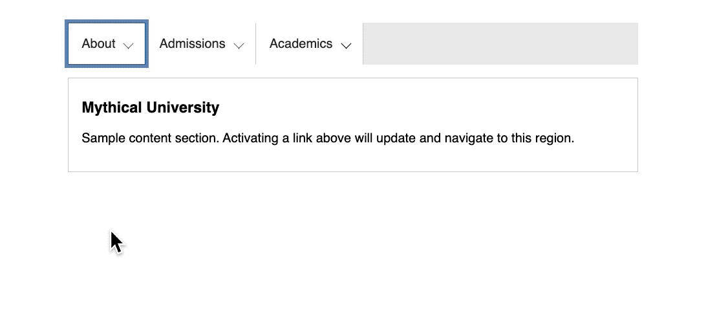

# Navigation enrichie avec JavaScript

> A JS exercise use at HEPL for DCC.

* * *

**js-tp-navigation-menus** is an educational project, which will be used for `JS` courses.

**Note:** the school where the course is given, the [HEPL](http://www.provincedeliege.be/hauteecole) from Liège, Belgium, is a French-speaking school. From this point, the instruction will be in French. Sorry.

* * *

## Énoncé

Dans le cadre de cet exercice, nous vous proposons d’enrichir l’utilisation du menu composé de deux niveaux. Cet exercice est particulièrement intéressant puisqu’il enrichit l’expérience utilisateur, est accessible au clavier et dégradable. Bref les qualités que nous aimons retrouver dans vos projets.

## Aides

1. Au clic sur un item de menu, affichez le menu imbriqué correspondant.
2. Assurez-vous de maintenir dans un état stable et cohérent la valeur de l’attribut `aria-expanded` des liens principaux du menu

## Bonus 🥳

Rendre l’utilisation du menu complètement accessible au clavier. Cela implique de pouvoir librement naviguer dans le menu à l’aide de la touche tabulation, mais aussi de pouvoir utiliser les flèches pour naviguer dans les items contenus dans le sous-menu.

## Source

[Example Disclosure for Navigation Menus](https://www.w3.org/TR/wai-aria-practices/examples/disclosure/disclosure-navigation.html)
